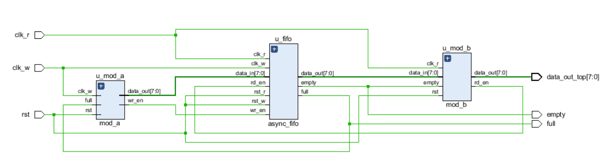
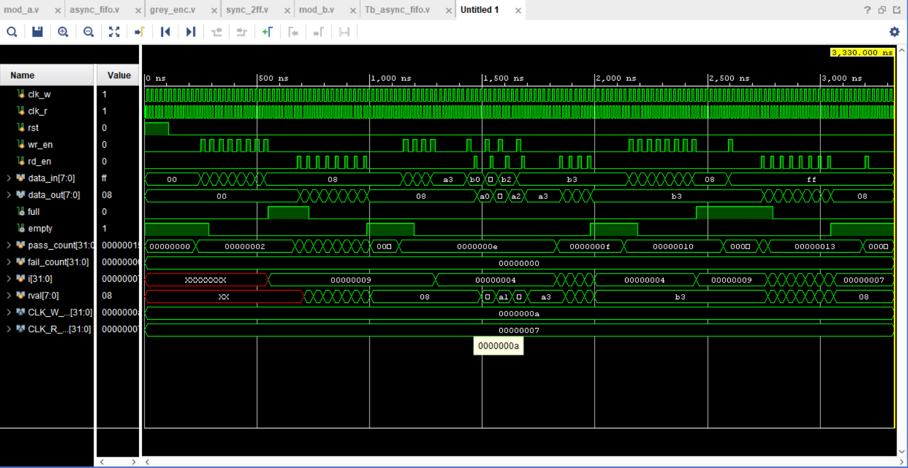

# Asynchronous Clock Domain Crossing (CDC) FIFO System

## Overview
This repository contains the design, implementation, and verification of a robust Asynchronous Clock Domain Crossing (CDC) FIFO system in Verilog. The primary objective of this architecture is to safely transfer multi-bit pointer data across two completely independent, unsynchronized clock domains without risking data corruption, pointer desynchronization, or metastability issues.

The system features a dual-clock FIFO memory core integrated with a dedicated data producer (`mod_a`) running in a **50 MHz write clock domain** and a data consumer (`mod_b`) running in a **75 MHz read clock domain**.

## Specifications & Performance Metrics
The circuit handles automatic data flow management and rate-matching under non-synchronized clock infrastructures.

| Parameter | Specification / Achieved Performance |
| :--- | :--- |
| **Write Domain Clock (`clk_w`)** | 50 MHz (20 ns period) |
| **Read Domain Clock (`clk_r`)** | 75 MHz (~13 ns period, offset by 3 ns to maximize timing stress) |
| **FIFO Memory Depth** | 8 Blocks |
| **Data Bus Width** | 8-bit Data (`DATA_WIDTH = 8`) |
| **Metastability Protection** | 2-Stage Flip-Flop (2-FF) Synchronizer Chain |
| **Glitch Mitigation** | Binary-to-Gray pointer conversion for domain crossing |

## Principle of Operation
Due to the independent clock frequencies, direct binary pointer crossing can lead to catastrophic setup/hold timing violations. The core architecture uses the following multi-bit synchronization flow:

* **Gray Code Transformation (`gray_enc.v`):** Multi-bit binary address counters are converted into Gray code pointers. Because Gray code changes only one bit per increment step, it completely eliminates the risk of a destination synchronizer sampling an illegal intermediate multi-bit value.
* **Metastability Resolution (`sync_2ff.v`):** A 2-stage Flip-Flop synchronizer safely bridges the pointers across the clock boundary, guaranteeing a statistically clean logic level before flag decoding.
* **Back-Pressure Flag Generation (`async_fifo.v`):** 
  * The **`empty`** flag is evaluated in the `clk_r` domain to instantly stall the consumer (`mod_b`) when empty, avoiding garbage reads.
  * The **`full`** flag is evaluated in the `clk_w` domain using Clifford Cummings' SNUG matrix calculation to back-pressure the producer (`mod_a`), avoiding memory overflow.

## Directory Structure
* **`async_fifo.v`** - Core dual-clock FIFO block containing memory, registered outputs, and status flag generation.
* **`gray_enc.v`** - Combinational binary-to-Gray converter block.
* **`sync_2ff.v`** - Double flip-flop synchronization chain used to bridge clock boundaries.
* **`mod_a.v`** - Data producer module (Write domain); implements automated back-pressure gating on the `full` flag.
* **`mod_b.v`** - Data consumer module (Read domain); utilizes a registered 3-state FSM (`IDLE` -> `WAIT` -> `READ`) for glitch-free performance.
* **`top.v`** - Top-level system module tying together the producer, memory core, and consumer blocks.
* **`Tb_async_fifo.v`** - Comprehensive, self-checking testbench walking through 6 rigorous edge-case scenarios.

## Schematics and Simulation Results

### 1. Elaborated Design Schematic
*The structural RTL block schematic highlights clear domain isolation connected through the dual-port RAM block and cross-domain synchronization logic paths.*

<p align="center">
  
</p>

### 2. Simulation Waveforms
*Behavioral simulation tracking the asynchronous interaction between `clk_w` and `clk_r`, demonstrating stable Gray code pointer transfers and synchronized flag state transitions.*

<p align="center">
  
</p>

### 3. TCL Console Verification Output
```text
================================================
  CDC ASYNC FIFO -- Self-Checking TB    
  clk_w=50MHz  clk_r=75MHz  depth=8    
================================================

[T1] Reset Behaviour
  PASS | EMPTY asserted after reset
  PASS | FULL  deasserted after reset

[T2] Write Until Full
  PASS | FULL asserts after 8 writes
  PASS | EMPTY stays low when full

[T3] Read Until Empty -- Data Integrity
  PASS | Data in order  [expected=0x01  got=0x01]
  PASS | Data in order  [expected=0x02  got=0x02]
  PASS | Data in order  [expected=0x03  got=0x03]
  PASS | Data in order  [expected=0x04  got=0x04]
  PASS | Data in order  [expected=0x05  got=0x05]
  PASS | Data in order  [expected=0x06  got=0x06]
  PASS | Data in order  [expected=0x07  got=0x07]
  PASS | Data in order  [expected=0x08  got=0x08]
  PASS | EMPTY asserts after full drain
  PASS | FULL  clears after drain

[T4] Simultaneous Write + Read
  INFO | Simultaneous CDC ops completed without lockup
  PASS | Not full after balanced write+read
  PASS | EMPTY after draining all remainder

[T5] Write-When-Full Rejection
  PASS | FULL before overflow attempt
  PASS | Still FULL after rejected write
  PASS | First byte uncorrupted (0x01) after overflow attempt

[T6] Read-When-Empty Rejection
  PASS | EMPTY confirmed before spurious read
  PASS | Still EMPTY after spurious read
  INFO | Empty flag held -- no ghost data produced

================================================
  RESULTS: 18 PASSED  |  0 FAILED
  STATUS : ALL TESTS PASSED
================================================# async-cdc-fifo-verilog
